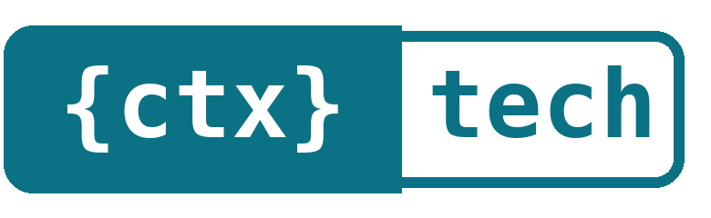

<p align="center"></p>

# ContexteTech

Hub open source de ressources pour LLM, dans l'esprit de Hugging Face :
**contextes** d'in-context learning, **prompts**, **datasets** de fine-tuning et
**configs LoRA**. Publication, fork, test en direct avec streaming, export vers
Axolotl / PEFT / 🤗 datasets. Interface en 5 langues (fr, en, es, de, it).

## Architecture

```
            ┌──────────── Caddy (HTTPS, HTTP/3, compression) ────────────┐
            │  /api/*  ──►  api  : FastAPI async · Uvicorn               │
            │  /*      ──►  web  : Astro SSR (HTML pur) + îlots Svelte   │
            └────────────────────────────────────────────────────────────┘
   api ──► PostgreSQL (Scaleway Managed Database, TLS)
   api ──► Redis (sessions, cache des listes, limitation de débit)
   api ──► Scaleway Object Storage (gros datasets, optionnel)
   api ──► LLM du bac à sable : Anthropic ou API compatible OpenAI (Ollama, vLLM)
```

- **Rendu** : les pages sont servies en HTML par Astro, sans JavaScript sauf pour
  les îlots interactifs (bac à sable, likes, formulaires). Les fiches sont
  indexables, avec `hreflang`, données structurées schema.org et sitemap.
- **Cache** : listes et facettes en Redis (30 s, invalidées à chaque écriture) ;
  pages anonymes en `s-maxage=60` pour un CDN ; assets `/_astro/*` immuables.
- **Streaming** : les réponses du bac à sable arrivent en SSE, mot par mot.
- **Sécurité** : sessions en cookie `HttpOnly` + `SameSite=Lax`, vérification
  d'origine sur toutes les écritures, mots de passe en Argon2.

## Production

contextetech.com tourne en conteneurs (API, site, Redis) derrière Caddy (TLS, HTTP/3)
et le CDN Bunny, avec PostgreSQL managé chez Scaleway. La procédure propre à ce
serveur n'est pas publiée ; `docker-compose.yml` et `deploy/Caddyfile` suffisent
pour installer ContexteTech sur votre propre machine.

## Démarrage (machine dédiée)

```bash
cp .env.example .env     # base Scaleway, domaine, clé API, mentions légales
docker compose up -d --build
docker compose logs -f api web
```

- Hub : `https://contextetech.com/` (redirige vers la langue du navigateur)
- Documentation de l'API : `https://contextetech.com/api/docs`

### Base de données Scaleway

1. Managed Databases → instance PostgreSQL 16 → base `contextec` + utilisateur dédié.
2. **Allowed IPs** : n'autoriser que l'IP du serveur Docker.
3. Reporter l'endpoint (IP, port) et les identifiants dans `.env`.
4. Activer les sauvegardes automatiques de l'instance.

Les migrations Alembic s'appliquent au démarrage de `api`.

Test local sans Scaleway : `POSTGRES_HOST=db`, `POSTGRES_PORT=5432`,
`POSTGRES_SSLMODE=disable`, `COOKIE_SECURE=0`, puis
`docker compose --profile local-db up -d`.

### Gros datasets

Jusqu'à 256 Ko, un dataset est stocké en base. Au-delà (jusqu'à `MAX_DATASET_MB`),
il part sur Scaleway Object Storage : créer un bucket privé et une clé API, puis
renseigner `S3_*`. Le téléchargement passe par une URL pré-signée.

### Bac à sable

| Mode | `.env` |
|---|---|
| Anthropic | `LLM_PROVIDER=anthropic` + `ANTHROPIC_API_KEY` |
| Ollama sur GPU local | `LLM_PROVIDER=openai`, `LLM_BASE_URL=http://ollama:11434/v1`, `docker compose --profile ollama up -d`, puis `docker compose exec ollama ollama pull qwen2.5:7b-instruct` |
| vLLM / autre | `LLM_PROVIDER=openai` + `LLM_BASE_URL` + `LLM_API_KEY` |
| Désactivé | `LLM_PROVIDER=` |

### Oracle Linux 9 / RHEL 9

```bash
sudo dnf config-manager --add-repo https://download.docker.com/linux/rhel/docker-ce.repo
sudo dnf install -y docker-ce docker-ce-cli containerd.io docker-compose-plugin
sudo systemctl enable --now docker
sudo firewall-cmd --permanent --add-service=http --add-service=https --add-port=443/udp
sudo firewall-cmd --reload
```

## Développement

```bash
# API
cd api && pip install -r requirements.txt
uvicorn app.main:app --reload
# Web
cd web && npm install && API_INTERNAL_URL=http://localhost:8000 npm run dev
```

## Images

```bash
IMAGE_PREFIX=ghcr.io/<compte> IMAGE_TAG=0.1.0 docker compose build
IMAGE_PREFIX=ghcr.io/<compte> IMAGE_TAG=0.1.0 docker compose push api web
```

## Licence

À choisir avant publication, puis ajouter le fichier `LICENSE`.

## Licence

Le code de ContexteTech est distribué sous licence **GNU AGPL-3.0** (voir [LICENSE](LICENSE)) :
vous pouvez l'utiliser, le modifier et le redistribuer, à condition de publier sous la même
licence le code de toute version modifiée, y compris quand elle est proposée en ligne.

Les fiches publiées sur contextetech.com gardent chacune la licence choisie par leur auteur
(indiquée sur la fiche) ; la licence AGPL-3.0 ne concerne que le logiciel.

## Marques et logos / Trademarks

Les noms ContexteTech et Contexthèque, les logos et les visuels ne sont pas couverts par l’AGPL-3.0 : voir [TRADEMARKS.md](TRADEMARKS.md). Toute réutilisation doit citer ContexteTech en source, avec un lien, dans ses mentions légales.
The ContexteTech and Contexthèque names, logos and visuals are not covered by the AGPL-3.0: see [TRADEMARKS.md](TRADEMARKS.md). Any reuse must credit ContexteTech as the source, with a link, in its legal notice.
